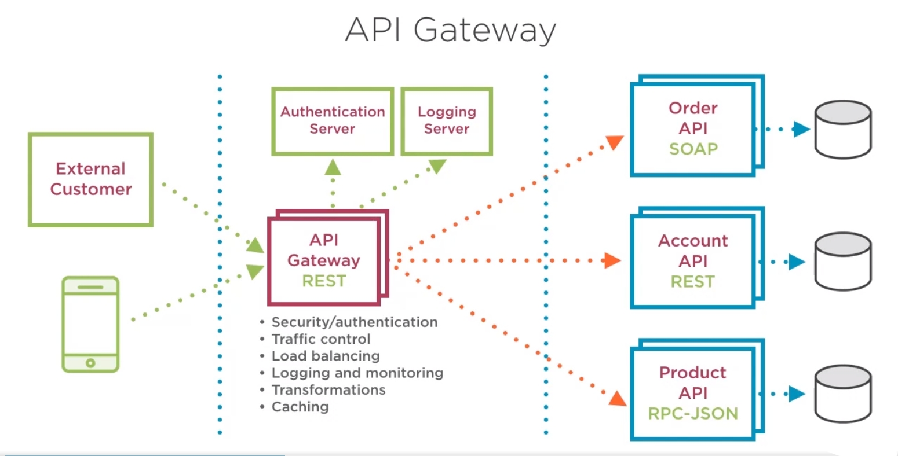
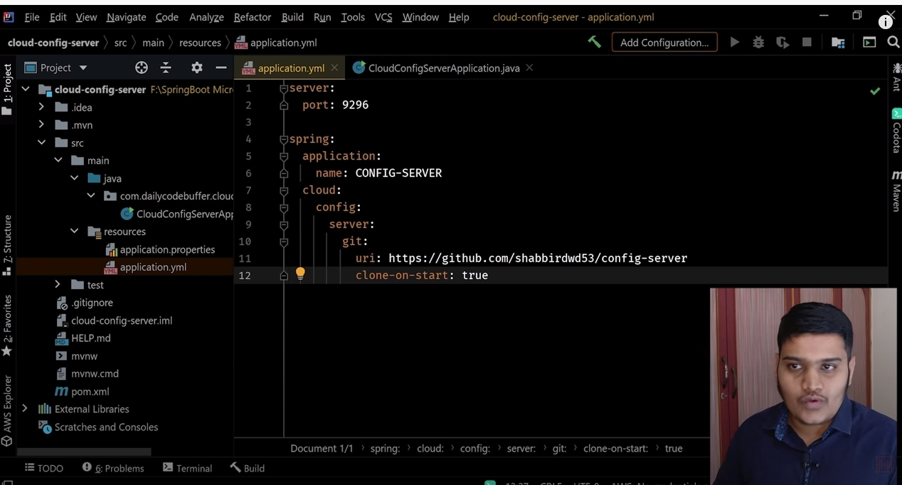
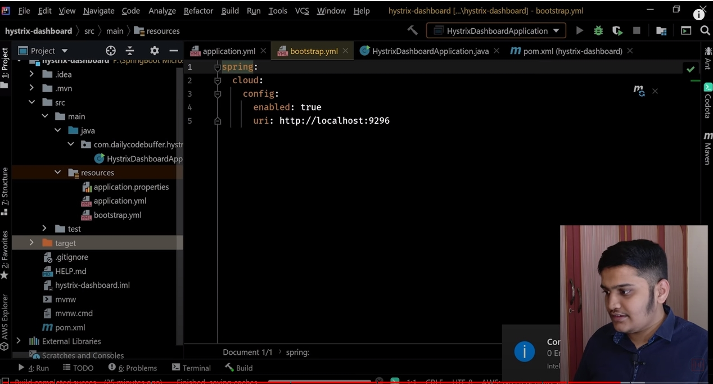
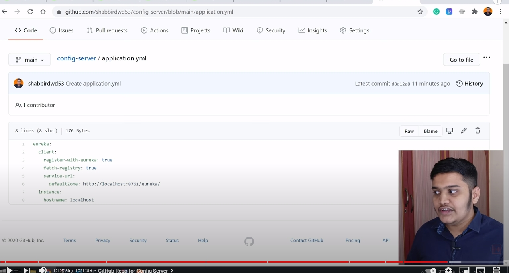

# Microservice Questions

## Microservices
- Microservices areautomous, independently, deployable services collaborate together to form a broader application

## Why we need microservices
- 

##  Compare the microservice and monolithic architectures. What are the advantages / disadvantages of each?
## Monoliths: 
- Single codebase, Single process Single host, Single database, Consistent technology
- **Benefit**: 
	- Simple, one codebase- easy to find, for deployment, there's only 1 application to update. 
	- It Works well for small app, with a small dev team (2-3 members), work together for a few months, moderate visitors
- **Problem**: its scale. 
	- When codebase become big, it is very difficute to deploy: Even one small change requires downtime and break the code
	- Really difficult to scale: unable to scale horizontally and vertical scalling are expensive. Plus, the entire application have to be scalled together
	- Hard to get away from legacy code since we have to move the entire application to a new framework
## Microservices:
- Benefit:
	- Contains small services that can be owned by small development team. A rule of thumb is it should be small enough to be throw away and rewritten in a different way
	- Able to adopt new technology without the need to update anything in one go. We can choose the right tool for the job
- Ability to deploy them individually which minimize downtime and reduce risk enable frequent updates
	- Scaling: scale the services individually
	- The services can be reuse
- Challenges:
	- Complex interaction 

## Distributed Monolith
- **Architechure base services** Have several services that run to different host and talk to each other over a network
- Have an architechture base services doesn't mean it not monolith. It can uses a shared database and tightly coupled to each other in a way we have to deploy them all together and all changes in the system we made required multiple services. They are often refferred as distributed monoliths. They combine all the downsize of monoliths with all challenges of microservices
- So better understand micro services very well before creating them or we could end up in a world of pain

##  How do you solve the different problems inherent to microservices?
- If not careful, a microservice can become a distribute monolith which consist of all disadvantage from both

##  What are the difference between a MSA and a SOA?

##  Can a Java microservice communicate with a Node.js microservice? Why or why not?

5.  What’s the difference between horizontal and vertical scalability? Which way do monoliths and microservices typically scale?

6.  What are some best practices for building microservices?

7.  How large should each service in a microservice be?

8.  What is a messaging queue and how is using one different from calling service APIs directly?

9.  Explain the Netflix OSS stack for microservices (Eureka, Zuul, Hystrix)

10.  How would you setup and configure Eureka? Zuul? Hystrix?

11.  What is the purpose of an API gateway and how does Zuul perform this?

12.  What is service discovery and how does Eureka do this (we used Consul)?

13.  What is the circuit breaker pattern and how does Hystrix implement it?
<br>

### SOAP Questions ⁉️

14.  What does the acronym SOAP stand for?

15.  What protocols and data format do SOAP services use?

16.  What is the “contract” for a SOAP service?

17.  What’s the structure of a SOAP message?

18.  What are the SOAP messaging modes? Messaging Exchange Patterns?

19.  Are SOAP messages delivered with GET or POST requests?
<br>
    
### REST Questions ⁉️

20.  What does the acronym REST stand for? What makes a service “RESTful”?  

21.  What protocols and data format do REST services use?  

22.  What are the architectural constraints of REST?  

23.  What is a “resource” in a REST service?  

24.  What does the “uniform interface” constraint mean? Give an example of some RESTful endpoints you would create for an API. Should the URLs contain nouns, verbs, or adjectives?    
<br>

## Docker Questions ⁉️
*Docker is an open platform for developing, shipping, and running applications. Docker enables you to separate your applications from your infrastructure so you can deliver software quickly.*

> [Here](https://github.com/210222-reston-java-msa/demos/blob/main/week6/docker.md) are the notes and guide on Docker
<br>

1.  What is containerization?
    
2.  What is the Docker Daemon?
    
3.  How are containers different from virtual machines? What makes docker containers more lightweight than virtual machines?
    
4.  What is a Docker image? Container?
    
  How is a Docker image different from a Docker container? How are the read/write layers different?
- A Docker image is a read-only, inert template that comes with instructions for deploying containers. A Docker image is made up of multiple layers.
-  Docker image as a recipe and a container as the cake baker from that recipe
Docker Image | Docker Container
------ | ------
Container blueprint | Image instance
immutable | Writable
Can exist without a cointainer | Must run an image to exist
Can be shared | It's already running, no need to share
Create only one | Can create multiple cointainer from the same image
    
6.  List the steps to start Docker, create a Docker image, and spin up a container.
- Create a Docker File at the root
```
FROM ubuntu:20.04
RUN apt update
```
    
7.  What is the relevance of the Dockerfile to this process? List some keywords in the Dockerfile.
    
8.  What is the benefit to an image being built in Layers?
    
9.  What are some other Docker commands?
    
10.  What is a container registry? How would you retrieve and upload images to DockerHub?
    
11.  What is Docker compose and why is it useful?
    
12.  If you want to store state for a container, how does Docker recommend doing that?
```docker run -v <volume_name>:<container_directory> <image_name>```





  

